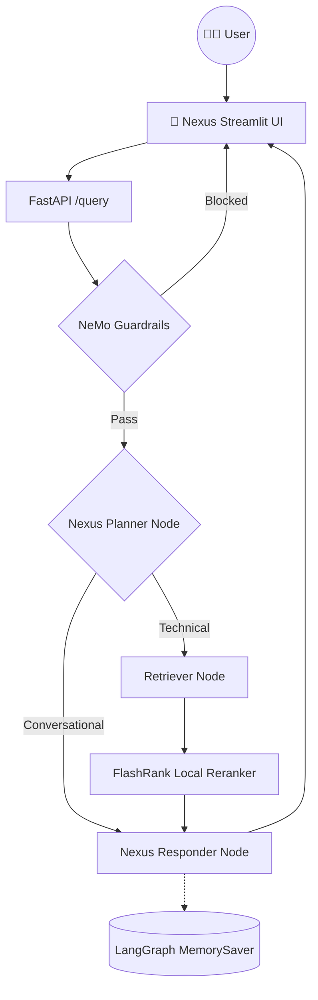

# 🌌 Nexus Document Engine

> **An advanced, production-grade RAG (Retrieval-Augmented Generation) system built to intelligently parse, analyze, and retrieve complex documentation.**

The **Nexus Document Engine** leverages **LangGraph**, **Portkey LLM Gateway**, and **Gemini Embeddings** to provide an intelligent, agentic chat experience. It is designed to distinguish between highly technical data and conversational inputs using semantic re-ranking, history-aware planning, and NeMo Guardrails to ensure input and output safety.

---

## ✨ Key Features

- **Agentic Intelligence**: Powered by LangGraph for cyclic reasoning, multi-step planning, and persistent conversational memory.
- **Strict Guardrails**: NeMo Guardrails automatically gate blocks off-topic prompts, jailbreak attempts, and injection inputs before retrieval even begins.
- **LLM Gateway Integration**: Portkey securely routes all LLM calls, providing automatic fallbacks between primary and backup inference keys (e.g., Groq).
- **High-Performance Search**: Qdrant Cloud handles high-speed vector search, while **FlashRank** provides zero-latency local semantic reranking.
- **Gemini Embeddings**: Utilizes Google's `gemini-embedding-2-preview` (3072-dim) via `langchain-google-genai` for deep semantic understanding.
- **Local Document Parsing**: PDF, HTML, TXT, DOCX, and PPTX files are parsed entirely on-device—no external OCR services required.
- **Deep Observability**: Full trace nesting and observability with **Pydantic Logfire** and **LangSmith** across every single agent node.
- **Evaluation Suite**: Includes a RAGAS-powered evaluation pipeline (measuring 6 key metrics) with a dedicated Streamlit demo application.

---

## 🧠 Agent Intelligence Flow



---

## 🏗️ Project Structure

```text
├── app/
│   ├── agents/
│   │   └── nodes/       # Nexus Planner, Retriever, and Responder LangGraph nodes
│   ├── gateway/         # Portkey LLM gateway — primary + fallback routing
│   ├── guardrails/      # NeMo Guardrails input/output filtering
│   ├── ingestion/
│   │   ├── chunking/    # Paragraph-based text splitter (1500 char max)
│   │   └── loaders/     # Local parsers — PDF (pypdf), HTML, TXT, DOCX, PPTX
│   ├── services/
│   │   └── retrieval/   # Gemini embeddings + Qdrant search + FlashRank reranking
│   ├── config.py        # Centralized environment variable management
│   └── main.py          # FastAPI entrypoint — guardrails gate + /query endpoint
├── evals/               # RAGAS evaluation suite + Streamlit demo
├── ui/                  # Sleek Streamlit chat interface with reasoning transparency
├── processed_data/      # Auto-generated — parsed & chunked JSON output per document
├── docs/                # Architectural and operational guides
├── DATA/                # Place your proprietary datasets here for ingestion
└── requirements.txt     # Pinned dependencies
```

---

## 🛠️ Tech Stack

| Layer | Technology |
|-------|-----------|
| **Orchestration** | LangChain + LangGraph |
| **LLMs** | Groq (Llama 3.3 70B) via **Portkey** gateway |
| **Guardrails** | NeMo Guardrails |
| **Vector DB** | Qdrant Cloud |
| **Reranking** | FlashRank (local, zero-latency) |
| **Embeddings** | Gemini `gemini-embedding-2-preview` (3072-dim) |
| **Document Parsing** | pypdf + pdfplumber (local, no OCR service) |
| **Observability** | Pydantic Logfire + LangSmith |
| **Evaluation** | RAGAS + custom Tool Correctness (Jaccard) |

---

## 🚀 Getting Started

### 1. Install dependencies

```powershell
python -m venv tenvv
.\tenvv\Scripts\activate
pip install -r requirements.txt
```

### 2. Configure environment

Copy the `.env.example` file to a new `.env` file and populate your keys:

```powershell
cp .env.example .env
```
*(Open `.env` and add your Groq, Portkey, Qdrant, Logfire, LangSmith, and Gemini API keys).*

### 3. Run data ingestion

Place your proprietary documents into the `DATA/` directory. Then parse, chunk, and index the vectors into Qdrant:

```powershell
python -m app.ingestion.processor DATA --wipe
```

> **Note:** Pass `--wipe` to drop and recreate the Qdrant collection. Omit it to append to an existing collection.

### 4. Launch the Nexus Platform

```powershell
# Terminal 1 — FastAPI backend
.\tenvv\Scripts\activate
uvicorn app.main:app --reload --port 8000

# Terminal 2 — Nexus Streamlit UI
.\tenvv\Scripts\activate
streamlit run ui/app.py
```

### 5. Run the evaluation suite (optional)

```powershell
# Requires the FastAPI backend running on :8000
.\tenvv\Scripts\activate
streamlit run evals/app.py
```

---

## 📚 Documentation Index

| # | Guide | What it covers |
|---|-------|---------------|
| 01 | [System Overview](docs/01_SYSTEM_OVERVIEW.md) | High-level vision and end-to-end flow |
| 02 | [Ingestion Engine](docs/02_INGESTION_ENGINE.md) | Document parsing and indexing pipeline |
| 03 | [Node Intelligence](docs/03_NODE_INTELLIGENCE.md) | Planner, Retriever, Responder internals |
| 04 | [Observability](docs/04_TRACING_AND_OBSERVABILITY.md) | Logfire + LangSmith tracing |
| 05 | [Environment Variables](docs/05_ENVIRONMENT_VARIABLES.md) | All env vars and configuration reference |
| 06 | [Known Gotchas](docs/06_KNOWN_GOTCHAS.md) | Non-obvious bugs and architectural decisions |
| 07 | [FlashRank Reranking](docs/07_FLASHRANK_RERANKING.md) | Local semantic reranker deep-dive |
| 08 | [Guardrails](docs/08_GUARDRAILS.md) | NeMo Guardrails implementation |
| 09 | [LLM Gateway](docs/09_LLM_GATEWAY.md) | Portkey routing, fallback, and observability |
| 10 | [Evals](docs/10_EVALS.md) | RAGAS metrics theory and token budget |
| 11 | [Evals Pipeline](docs/11_EVALS_PIPELINE.md) | Live eval pipeline and Streamlit demo |

---

*Built for High-Scale Enterprise Document Intelligence.*
